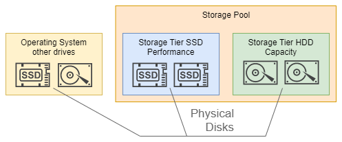
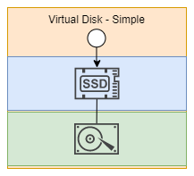
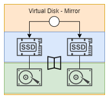
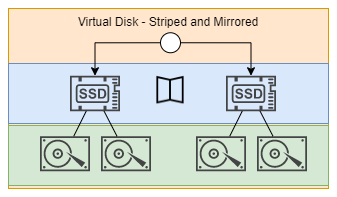
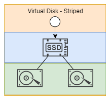

# Create Storage Spaces in Windows 10
Windows Server O/S contains Storage Spaces support for Server Spaces tiered storage. 
You can front slower spinning disks with smaller faster SSDs. 
Windows 10 has a Storage Spaces GUI Control Panel that does not include the tiered storage GUI. 
This means PowerShell must be used for all configuration.



[This repository](https://github.com/freemansoft/win10-storage-spaces) contains scripts that create tiered storage pools that integrate SSDs as caching drives and HDDs as storage drives. They assume you have at least one SSD and one HDD.

* The scripts automatically find all raw drives and add them to the pool.  
* Some HDDs have their types incorrectly identified.  The script can coerce them to be MediaType:HDD
* The entire virtual drive is added to the system as a single large volume
* You need at least 
  * 1 SSD and 1 HDD to run cached storage / Simple resiliency
  * 2 SSD and 2 HDDs to run cached storage / Mirror resiliency / 
  * 1 SSD and 2 HDDs to run cached storage / Simple resiliency / striped storage (sum of HDD space)

  

# Scripts 
## new-storage-space.ps1
Creates a tiered storage pool and allocates all the disk space to a single drive
* You can change the drive letter and label by editing the variables at the top.
* The script can auto size the drive and cache.  That didn't work for me, so the script supports manual sizing.

## remove-storage-space.ps1
Removes the virtual drive, the storage tiers and then the storage pool.
* All drives are returned the _Primordial_ pool.

# Sample configuration
*new-storage-space.ps* created a Virtual drive from 3 physical drives

| Physical Drives | Storage Space Virtual Drive|
|-----------------|-----------------------------|
| Two 2 TB HDD     | Single 3.6 TB data volume _striped_ across my two HDD |
| One 200 GB SSD.  | With a 200 GB read/write cache. |

 

## Win 10 Pro Storage Spaces Control Panel
The control panel does not display or manipulate tiers


## ResiliancyName: Simple vs Mirror
The “Mirror” resiliency level attempts to mirror both SSD and HDD tiers, so you would need 4 drives run mirror, to mirror both tiers

## Caching Impact Benchmark
All Storage Pool drives connected to 3Gb/s SATA.  The write-back cache is not used with sequential writes over 256 KB.

```
[Read]                           *Single 2TB no cache*           *Two 2TB mirrored with 200GB cache*
Sequential 1MiB (Q=  8, T= 1):   160.497 MB/s [    153.1 IOPS]   282.983 MB/s [    269.9 IOPS]
Sequential 1MiB (Q=  1, T= 1):   156.766 MB/s [    149.5 IOPS]   254.605 MB/s [    242.8 IOPS]
    Random 4KiB (Q= 32, T=16):     1.748 MB/s [    426.8 IOPS]   175.272 MB/s [  42791.0 IOPS]
    Random 4KiB (Q=  1, T= 1):     0.527 MB/s [    128.7 IOPS]    21.189 MB/s [   5173.1 IOPS]

[Write]                          *Single 2TB no cache*           *Two 2TB mirrored with 200GB cache*
Sequential 1MiB (Q=  8, T= 1):   153.896 MB/s [    146.8 IOPS]   226.825 MB/s [    216.3 IOPS]
Sequential 1MiB (Q=  1, T= 1):   154.147 MB/s [    147.0 IOPS]   230.149 MB/s [    219.5 IOPS]
    Random 4KiB (Q= 32, T=16):     2.033 MB/s [    496.3 IOPS]   149.000 MB/s [  36377.0 IOPS]
    Random 4KiB (Q=  1, T= 1):     1.706 MB/s [    416.5 IOPS]    38.790 MB/s [   9470.2 IOPS]

```

## Example state 
### Before script
Three drives can pool.  The HDD drive media types are not recognized.
```
PS C:\WINDOWS\system32> Get-PhysicalDisk
Number FriendlyName           SerialNumber         MediaType   CanPool OperationalStatus HealthStatus Usage            Size
------ ------------           ------------         ---------   ------- ----------------- ------------ -----            ----
0      SanDisk Ultra II 480GB xxxxxxxxxxxx         SSD         False   OK                Healthy      Auto-Select 447.13 GB
4      ATA WDC WD20EFRX-68A   WD-xxxxxxxxxxxx      Unspecified True    OK                Healthy      Auto-Select   1.82 TB
3      ATA WDC WD20EFRX-68A   WD-xxxxxxxxxxxx      Unspecified True    OK                Healthy      Auto-Select   1.82 TB
1      ATA KINGSTON SH103S3   xxxxxxxxxxxxxxxx     SSD         False   OK                Healthy      Auto-Select 223.57 GB
2      ATA LITEONIT LCS-256   xxxxxxxxxxxxxxxxxxxx SSD         True    OK                Healthy      Auto-Select 238.47 GB
```

### After creating Virtual Drive
```
PS C:\WINDOWS\system32> Get-PhysicalDisk
Number FriendlyName           SerialNumber         MediaType CanPool OperationalStatus HealthStatus Usage            Size
------ ------------           ------------         --------- ------- ----------------- ------------ -----            ----
0      SanDisk Ultra II 480GB xxxxxxxxxxxx         SSD       False   OK                Healthy      Auto-Select 447.13 GB
4      ATA WDC WD20EFRX-68A   WD-xxxxxxxxxxxx      HDD       False   OK                Healthy      Auto-Select   1.82 TB
3      ATA WDC WD20EFRX-68A   WD-xxxxxxxxxxxx      HDD       False   OK                Healthy      Auto-Select   1.82 TB
1      ATA KINGSTON SH103S3   xxxxxxxxxxxxxxxx     SSD       False   OK                Healthy      Auto-Select 223.57 GB
2      ATA LITEONIT LCS-256   xxxxxxxxxxxxxxxxxxxx SSD       False   OK                Healthy      Auto-Select 238.47 GB

PS C:\WINDOWS\system32> Get-StoragePool
FriendlyName    OperationalStatus HealthStatus IsPrimordial IsReadOnly    Size AllocatedSize
------------    ----------------- ------------ ------------ ----------    ---- -------------
Primordial      OK                Healthy      True         False      4.53 TB       3.86 TB
My Storage Pool OK                Healthy      False        False      3.86 TB       3.66 TB

PS C:\WINDOWS\system32> Get-StorageTier
FriendlyName                  TierClass   MediaType ResiliencySettingName FaultDomainRedundancy    Size FootprintOnPool StorageEfficiency
------------                  ---------   --------- --------------------- ---------------------    ---- --------------- -----------------
SSDTier                       Unknown     SSD       Simple                0                        0 B             0 B
My Tiered VirtualDisk-HDDTier Capacity    HDD       Simple                0                     3.46 TB         3.46 TB           100.00%
My Tiered VirtualDisk-SSDTier Performance SSD       Simple                0                      211 GB          211 GB           100.00%
HDDTier                       Unknown     HDD       Simple                0                        0 B             0 B

PS C:\WINDOWS\system32> Get-VirtualDisk
FriendlyName          ResiliencySettingName FaultDomainRedundancy OperationalStatus HealthStatus    Size FootprintOnPool StorageEfficiency
------------          --------------------- --------------------- ----------------- ------------    ---- --------------- -----------------
My Tiered VirtualDisk                                             OK                Healthy      3.66 TB         3.66 TB            99.97%
```

# Credits
* Most of the script came from this great [blog article by Nils Schimmelmann](https://nils.schimmelmann.us/post/153541254987/intel-smart-response-technology-vs-windows-10)
* See [Joe's blog](https://joe.blog.freemansoft.com) for any updates